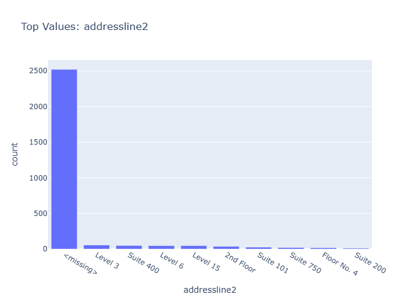

# Insights: Category Addressline2

## Data Insight
- The vast majority of records (approximately 2500) have a missing value for 'addressline2'. Among the present values, 'Level 3', 'Suite 400', 'Level 6', 'Level 15', '2nd Floor', 'Suite 101', 'Suite 750', 'Floor No. 4', and 'Suite 200' appear infrequently.

## Analysis Insight
- The 'addressline2' field exhibits severe data sparsity, with a prevalence of missing entries. This suggests potential issues with data collection or entry for this specific field, hindering detailed location-based analysis.

## Caveat
- The significant number of missing 'addressline2' values limits the reliability of any analysis focusing on address-specific trends or segments. Further investigation into data collection processes is recommended.
