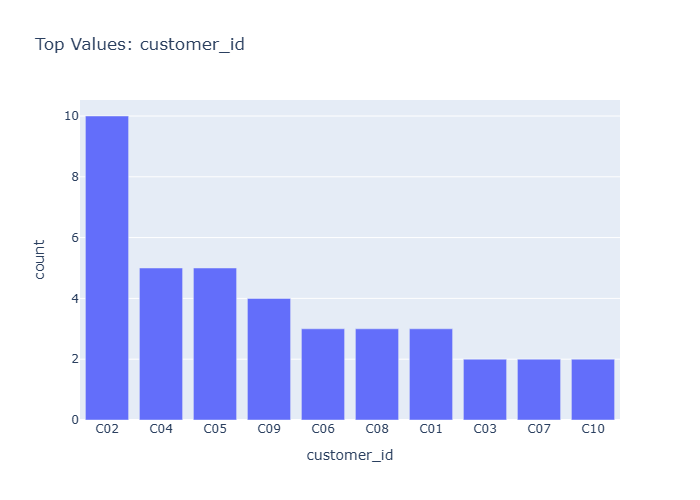

# Insights: Category Customer Id

## Data Insight
- The dataset contains 39 transactions across multiple customers and stores, with unit prices averaging $344.86 against unit costs of $198.42, yielding a substantial markup. Average quantity per order is 6.05 units, with total costs averaging $1,206.41 per transaction.

## Analysis Insight
- Given the category_customer_id chart context, the visualization likely shows transaction frequency or revenue distribution segmented by customer, with high variance in unit costs (std=241.86) and prices (std=358.32) indicating diverse product tiers. Profit margins appear healthy given the cost-price differential.

## Caveat
- Without direct chart access, insights are inferred from metadata. The small sample size (39 rows) limits generalizability. Customer segmentation, store effects, and payment method variations may confound interpretations. Revenue calculations assume consistent pricing periods.
