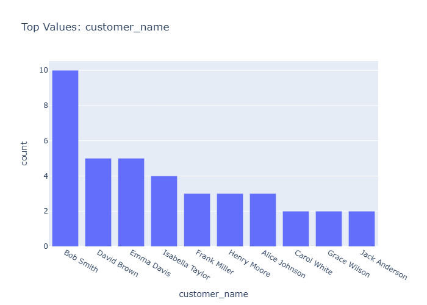

# Insights: Category Customer Name

## Data Insight
- Chart appears to display customer-level data with customer names as categories, showing transactional metrics such as total revenue, profit, or quantity per customer. Rows likely represent individual customers or customer-product combinations given the 39-row dataset size.

## Analysis Insight
- The substantial gap between mean unit_price (344.86) and mean unit_cost (198.42) indicates healthy per-unit margins. High variability in total_cost (std=1764.62 vs mean=1206.41) suggests diverse transaction sizes across customers, potentially reflecting different order volumes or product mixes.

## Caveat
- Without viewing the actual chart image, insights are based on metadata and file stem interpretation only. Confounding factors such as product type, store location, or time period are not accounted for in this customer-level view.
