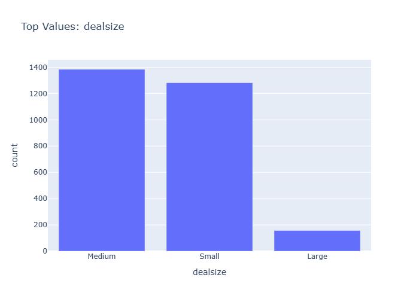

# Insights: Category Dealsize

## Data Insight
- The bar chart shows that 'Medium' and 'Small' deal sizes are the most frequent categories, with counts around 1400 and 1250 respectively. 'Large' deal sizes are significantly less frequent, with a count below 200.

## Analysis Insight
- Most deals observed in the dataset are categorized as 'Medium' or 'Small'. This suggests a business strategy or market dynamic that favors or results in a higher volume of smaller to medium-sized transactions compared to large ones.

## Caveat
- The chart only displays the count of deals by size category. It does not provide information on the total sales value for each category, the time period covered, or potential data inaccuracies in the 'dealsize' classification.
