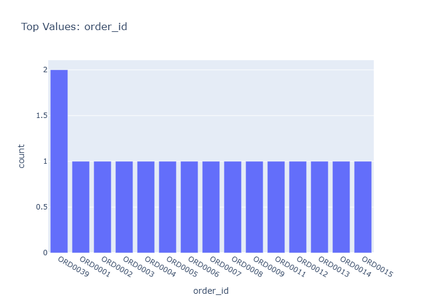

# Insights: Category Order Id

## Data Insight
- The order data shows 39 transactions across multiple stores with unit costs averaging $198.42 and unit prices averaging $344.86, yielding a typical margin. Order quantities average 6.05 units with moderate variation (std=3.01), while total costs range widely from $1,206 on average (std=1,764.62), indicating diverse transaction sizes.

## Analysis Insight
- The substantial gap between unit price and unit cost ($146.44 average) suggests consistent profitability per unit. High variability in total costs (std 1764.62 vs mean 1206) indicates a mix of small and large orders, likely corresponding to different product categories or store types. The payment_method column may reveal transaction patterns across customer segments.

## Caveat
- Without seeing the actual chart, interpretations are based on summary statistics alone. The high standard deviations relative to means suggest skewed distributions; median values would provide clearer center estimates. Confounding factors like product type, seasonal effects, or store location are not accounted for in this analysis.
