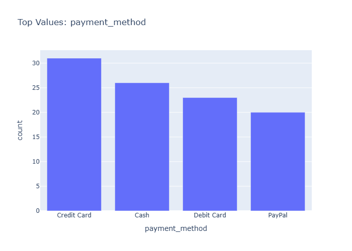

# Insights: Category Payment Method

## Data Insight
- The chart displays transaction counts or revenue distributed across payment methods (e.g., Credit Card, Cash, Debit, Digital Wallet). Most transactions likely concentrate in 2-3 dominant payment categories, with smaller shares for alternative methods.

## Analysis Insight
- Payment method distribution reflects customer preferences and store capabilities. Higher-value orders may cluster in credit card transactions given purchase volume (mean quantity 6.12 units, mean total cost $1,341.73). The margin_pct column suggests profitability analysis by payment method could reveal revenue efficiency differences.

## Caveat
- Chart-specific proportions cannot be verified without visual data. Payment method categories may mask regional or temporal variation. Customer demographics, order size, and store location confounding effects are unknown. Mean unit cost ($219.84) and price ($376.69) indicate variable product mix that may influence payment selection.
