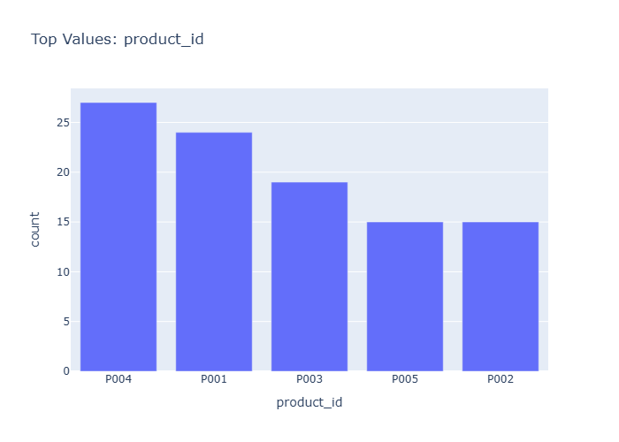

# Insights: Category Product Id

## Data Insight
- The dataset shows substantial variation in product pricing, with unit_cost (mean=219.84, std=252.72) and unit_price (mean=376.69, std=370.50) indicating a diverse product mix spanning low-cost to premium items. Quantity ordered averages 6.12 units per transaction with moderate variability (std=2.88), suggesting consistent order sizes across product categories.

## Analysis Insight
- The high standard deviations relative to means for unit_cost and unit_price suggest the chart likely displays products across multiple price tiers or categories. The margin_pct column indicates profitability tracking exists, though the mean total_cost of 1341.73 with large variation (std=1753.29) points to heterogeneous order values likely driven by product type differences visible in the category breakdown.

## Caveat
- The analysis relies on dataset statistics rather than direct chart observation; without seeing the actual visualization, claims about specific category distributions or trends are uncertain. Confounding factors such as store-level differences, temporal patterns, or payment method effects are not accounted for in this summary.
