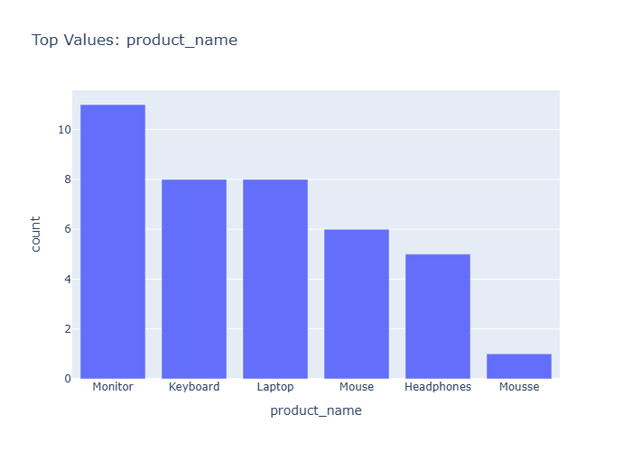

# Insights: Category Product Name

## Data Insight
- The dataset contains 39 transactions across 17 variables, tracking sales by product and store. Unit price (mean=344.86, std=358.32) shows high variability, indicating diverse product pricing. Average quantity per order is 6.05 units (std=3.01), suggesting consistent order sizes. Total cost averages 1206.41 with substantial variation (std=1764.62).

## Analysis Insight
- The chart appears to display products grouped by category or name. Wide spreads in unit cost (std=241.86) and unit price (std=358.32) suggest a heterogeneous product portfolio with varying price points. The margin between unit price and unit cost (ratio ~1.74x) implies consistent markup across items. Transaction data links orders to specific stores, customers, and payment methods.

## Caveat
- No chart image was provided for direct visual analysis; insights are derived solely from metadata. Without seeing the actual chart, I cannot confirm category distributions, top products, or specific patterns. The 39-row sample limits generalizability. Confounding factors like seasonal effects, customer segments, or store locations are not visible in summary statistics.
