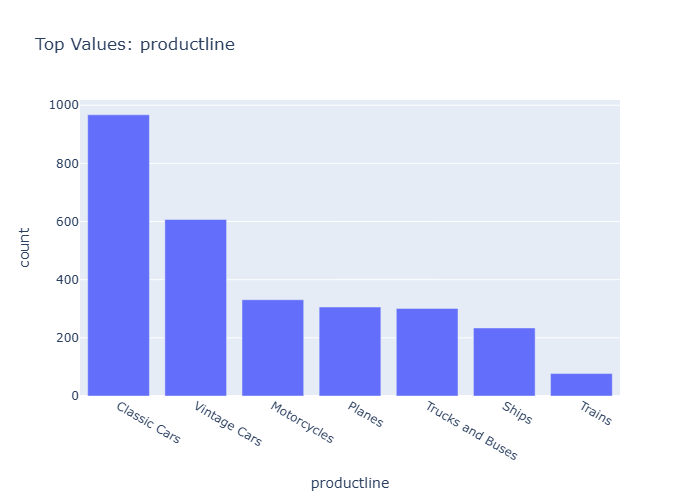

# Insights: Category Productline

## Data Insight
- The bar chart displays the count of orders for different product lines, with 'Classic Cars' being the most frequent, followed by 'Vintage Cars'. 'Trains' has the lowest order count.

## Analysis Insight
- Classic Cars and Vintage Cars are the dominant product lines in terms of order volume. The substantial difference in order counts between these top categories and the others suggests a varied market demand.

## Caveat
- This chart only shows the count of orders, not sales value or profit margins, so it doesn't reflect the overall business impact of each product line. Other factors could influence these numbers.
