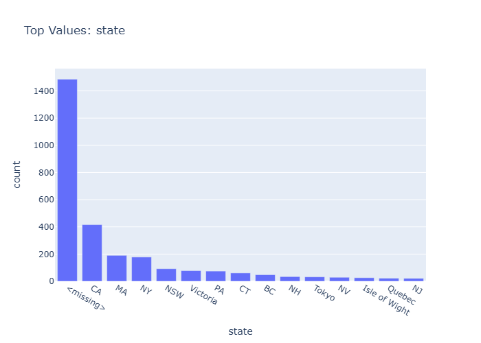

# Insights: Category State

## Data Insight
- The state 'CA' has the highest count of orders, exceeding 1400.  The second highest category is '<missing>' with approximately 400 orders, followed by 'MA' with around 200 orders.  All other states have significantly fewer orders.

## Analysis Insight
- California appears to be a primary market. The substantial number of missing state values suggests potential data quality issues or a significant number of customers with unrecorded locations, warranting further investigation.

## Caveat
- The chart shows counts, not sales value or volume. The category '<missing>' could represent various reasons for unrecorded data, and its high frequency might skew interpretations of geographic performance without further data treatment.
