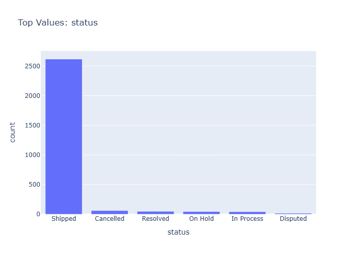

# Insights: Category Status

## Data Insight
- The bar chart displays the frequency count of different order statuses. 'Shipped' is the overwhelmingly most frequent status, with approximately 2600+ occurrences. All other statuses, including 'Cancelled', 'Resolved', 'On Hold', 'In Process', and 'Disputed', have significantly lower counts, each with fewer than 100 occurrences.

## Analysis Insight
- The data indicates a high volume of successfully shipped orders, suggesting efficient order fulfillment. The low counts for other statuses may point to a streamlined process or infrequent issues. Further investigation could explore the characteristics and reasons behind the 'Disputed' and 'Cancelled' orders.

## Caveat
- The chart shows raw counts and does not account for the total number of orders attempted or the value of orders in each status. The low counts for other statuses could be due to infrequent issues or errors in data recording and categorization.
