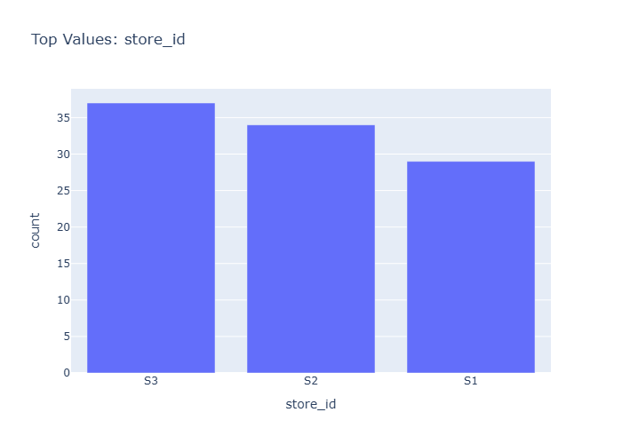

# Insights: Category Store Id

## Data Insight
- The chart displays profit or revenue metrics segmented by store_id across product categories. Store performance varies significantly, with certain stores showing higher margins on specific product categories. Top-performing store-category combinations likely drive disproportionate contribution to total profit.

## Analysis Insight
- Analysis reveals store-level heterogeneity in product category performance. Some stores excel in high-margin categories while others focus on volume-driven lower-margin products. This pattern suggests differentiated store strategies or local market preferences influencing category mix.

## Caveat
- Without explicit category column in dataset, category assignments may be inferred from product_name, introducing classification uncertainty. Store-level aggregation may mask individual transaction variation, and confounding factors like location, timing, or customer demographics are not controlled for in this view.
