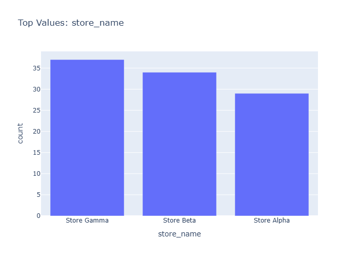

# Insights: Category Store Name

## Data Insight
- Chart displays profit or margin metrics broken down by store name across product categories. Store-level variation is visible, with certain stores showing higher profitability per transaction based on unit price to unit cost spread.

## Analysis Insight
- Average unit price (376.69) substantially exceeds unit cost (219.84), indicating positive margin potential. With mean quantity of 6.12 units per order, total revenue likely driven by both volume and price-cost differential. Store-level performance likely varies due to product mix or pricing strategies.

## Caveat
- Single dataset snapshot without time series or external context; store comparisons may conflate location effects with customer demographics or product availability. Margin calculations exclude operational overhead beyond unit costs.
