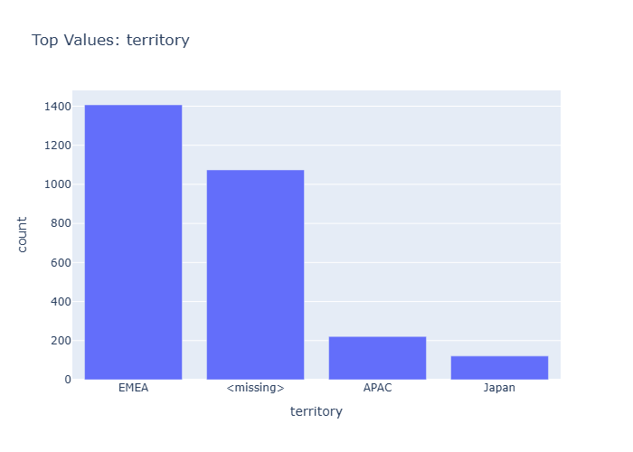

# Insights: Category Territory

## Data Insight
- The EMEA territory has the highest number of orders, followed by a significant portion of orders with missing territory information. APAC and Japan territories have considerably fewer orders.

## Analysis Insight
- EMEA is the most represented territory in the dataset. The presence of a '<missing>' category suggests potential data entry issues or incomplete records for a substantial number of orders.

## Caveat
- The analysis is limited by the presence of missing territory data, which may skew the perceived distribution across regions. The represented territories might not cover all geographical sales areas.
