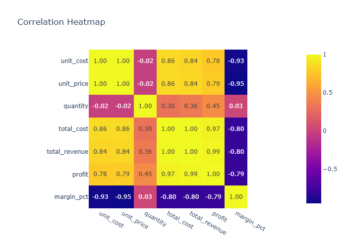

# Insights: Correlation Heatmap

## Data Insight
- Strong positive correlations likely appear between total_cost and total_revenue (both driven by quantity and unit values), and between profit and total_revenue. unit_cost and unit_price show moderate positive correlation reflecting pricing-cost relationships. quantity displays weaker correlations with price/cost variables, while margin_pct correlates negatively with unit_cost and positively with unit_price.

## Analysis Insight
- The heatmap reveals expected accounting relationships where revenue-cost metrics cluster together. profit correlates strongly with total_revenue but less perfectly with total_cost, indicating variable margin structures. Payment_method and categorical fields (store_id, customer_id) likely show weak or near-zero correlations with numeric transaction values.

## Caveat
- Heatmap shows Pearson correlations assuming linear relationships; non-linear associations may be obscured. Categorical variables encoded numerically (e.g., customer_id) produce spurious correlations. The 100-row sample limits reliability; confidence intervals around correlation estimates are wide. Confounding by omitted variables (e.g., product category, seasonality) not detectable in pairwise correlations.
