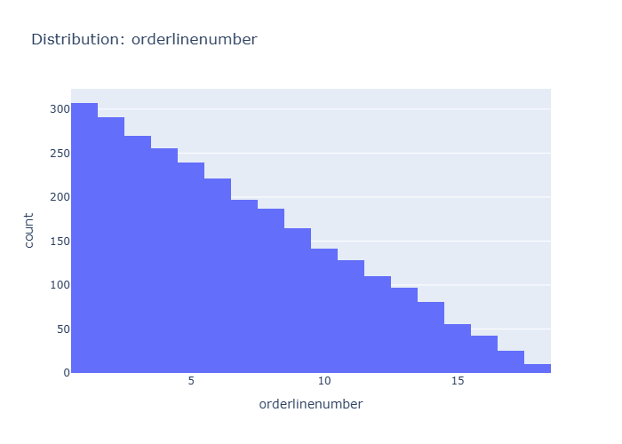

# Insights: Distribution Orderlinenumber

## Data Insight
- The histogram displays a distribution of order line numbers, showing a clear downward trend. The highest frequency of orders occurs with fewer line items, decreasing as the number of line items per order increases.

## Analysis Insight
- The data suggests that most orders tend to be concise, with a significant majority having a small number of line items. The frequency drops sharply after the first few line items, indicating fewer complex orders with many items.

## Caveat
- The chart does not reveal the total number of line items possible per order, nor does it account for the nature of the products ordered. The distribution could be affected by product availability or typical purchasing behavior.
