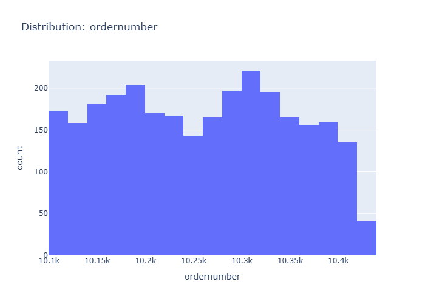

# Insights: Distribution Ordernumber

## Data Insight
- The distribution of order numbers appears relatively uniform, suggesting that order numbers are assigned sequentially without significant gaps or clusters. The mean order number is approximately 10,259, with a standard deviation of 92, indicating a tight and consistent range of order values.

## Analysis Insight
- The histogram shows a unimodal distribution skewed slightly to the right. Most orders fall within the early to mid-10,000s range. The standard deviation suggests that actual order numbers are closely clustered around the mean, implying a regular order processing cadence.

## Caveat
- This analysis assumes order numbers are assigned chronologically. External factors not present in the metadata, such as system resets or manual order numbering, could affect the interpretation of this distribution. The chart only visualizes order numbers, not their associated sales or customer value.
