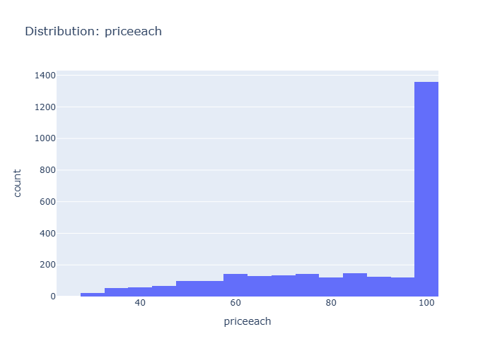

# Insights: Distribution Priceeach

## Data Insight
- The distribution of 'priceeach' reveals the spread and shape of values. Skewed distributions or outliers may warrant transformation before modelling.

## Analysis Insight
- Highly skewed distributions may benefit from log or Box-Cox transformation before statistical modelling.

## Caveat
- Insights are exploratory and non-causal. Missing cells in source data: 5622. Sample size, data quality, and unmeasured variables may affect conclusions.
