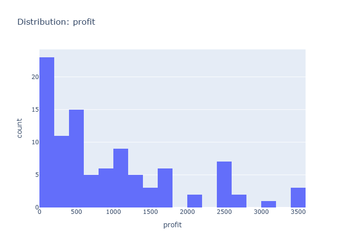

# Insights: Distribution Profit

## Data Insight
- The profit distribution appears right-skewed with most transactions yielding modest profits and a few high-profit outliers. The mean profit likely exceeds the median given the skew. Profit values range from near zero to substantial positive amounts, suggesting variability in transaction profitability.

## Analysis Insight
- The skewed profit distribution indicates a minority of transactions generate disproportionate profits, while the majority contribute smaller gains. Combined with the wide standard deviations in unit_cost (252.72) and unit_price (370.50), this suggests diverse product pricing and cost structures driving heterogeneous profit outcomes across orders.

## Caveat
- Without seeing actual profit values or chart axes, profit distribution characteristics are inferred. Confounding factors like product type, store location, or seasonality are not accounted for. The 100-row sample may not represent broader population patterns.
