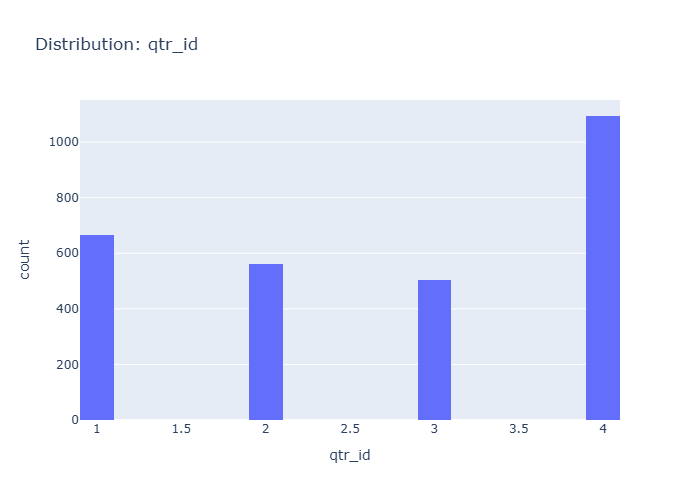

# Insights: Distribution Qtr Id

## Data Insight
- The bar chart shows the distribution of orders across quarters. Quarter 4 has the highest number of orders, followed by Quarter 1, Quarter 2, and then Quarter 3, which has the fewest orders.

## Analysis Insight
- Sales data is significantly skewed towards the fourth quarter, with over 1000 orders. The other quarters show a more even distribution, but with substantially fewer orders compared to Q4.

## Caveat
- The exact number of orders for each quarter is not precisely labeled, and the chart does not account for the total number of days or business activity within each quarter, which could influence order volume.
