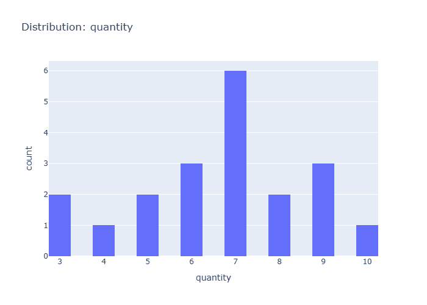

# Insights: Distribution Quantity

## Data Insight
- The distribution of quantity shows a peak at 7 units, with a secondary peak at 3 and 5 units. Quantities 4, 8, 9, and 10 have significantly lower counts. The data suggests a preference for moderate quantities, with 7 units being the most frequent order size.

## Analysis Insight
- The histogram visualizes the frequency of different order quantities. The distribution is unimodal with a clear peak at quantity 7, indicating it's the most common order size. The mean quantity is 6.65, which aligns with the visual representation of the distribution's center.

## Caveat
- The dataset size is small (20 rows), limiting the generalizability of these findings. The distribution might change with a larger sample. Additionally, the chart doesn't show quantities below 3 or above 10, so the complete distribution is not represented.
