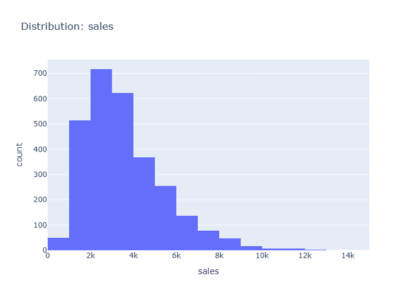

# Insights: Distribution Sales

## Data Insight
- The distribution of sales is right-skewed, with the majority of sales falling between 1,000 and 4,000. There are fewer occurrences of sales exceeding 4,000, and a long tail extends to the right, indicating occasional high-value sales.

## Analysis Insight
- The histogram shows a prominent peak in sales between 2,000 and 4,000 units. The sales data appears to be concentrated in the lower to mid-range, with a decreasing frequency as sales values increase.

## Caveat
- This analysis is based on the provided sales data and does not account for other factors that might influence sales, such as marketing campaigns, seasonality, or economic conditions, which could lead to confounding variables.
