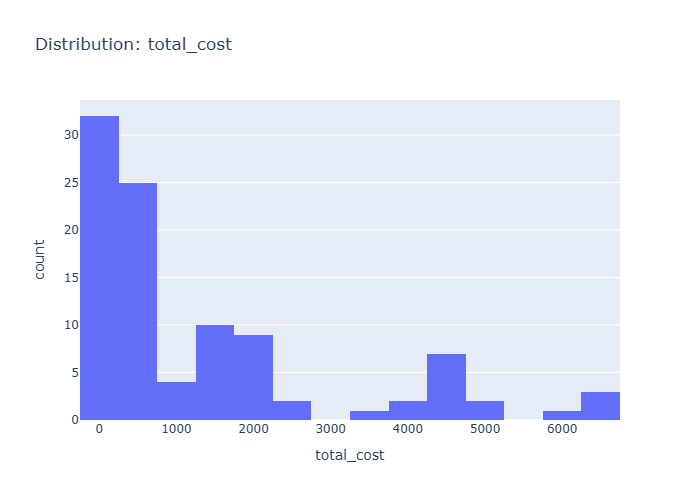

# Insights: Distribution Total Cost

## Data Insight
- The histogram displays total cost distribution with right-skewed pattern, mean at 1341.73 and high standard deviation of 1753.29, indicating wide variance across orders with majority clustered at lower cost values.

## Analysis Insight
- The positive skew suggests a subset of of orders incur substantially higher costs than typical transactions, likely driven by large quantity orders or high unit cost products, creating a long tail toward premium spending levels.

## Caveat
- Without knowing the median or viewing the actual distribution shape, inferring skewness relies on summary statistics; outlier influence on mean may distort typical cost perception, and payment method or store-level confounding not addressed.
