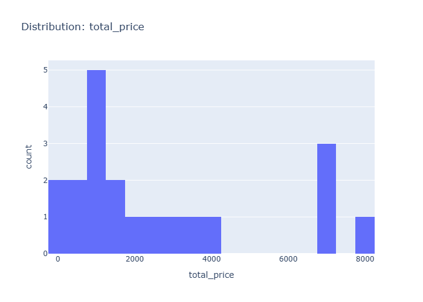

# Insights: Distribution Total Price

## Data Insight
- The histogram shows that most orders have a total price between 0 and 1,000, with a significant drop in frequency for prices between 1,000 and 4,000. There are two distinct peaks, one around 1,000 and another around 7,000-8,000.

## Analysis Insight
- The distribution of total_price is highly skewed. The majority of orders fall into the lower price ranges, suggesting a concentration of lower-value transactions. The presence of higher-priced orders creates a long tail in the distribution.

## Caveat
- The small dataset size (20 rows) limits the generalizability of these findings. The binning method might obscure finer price point variations. Outliers or specific product types could be driving the higher price clusters.
