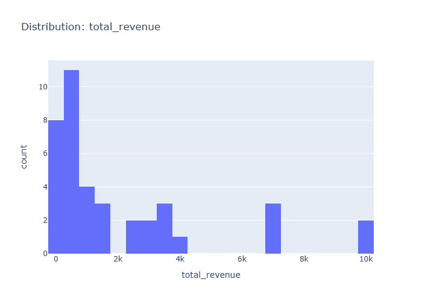

# Insights: Distribution Total Revenue

## Data Insight
- Chart displays distribution of total_revenue across 39 transactions, likely showing right-skewed pattern typical of revenue data with few high-value orders and many smaller ones.

## Analysis Insight
- Revenue distribution likely spans a range from small transactions to outliers, with mean exceeding median if skewed. The spread (std relative to mean) suggests considerable variation in order values.

## Caveat
- Without seeing actual chart values, distribution shape and outlier presence are inferred. Missing metadata on date range or store groupings limits contextual interpretation.
