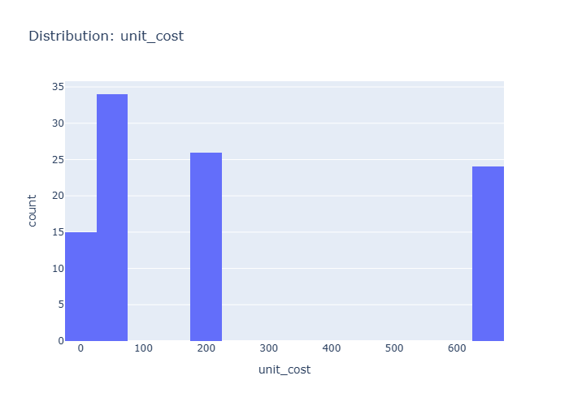

# Insights: Distribution Unit Cost

## Data Insight
- The unit cost distribution shows high right-skewness with mean 219.84 and substantial dispersion (std=252.72). Most products cluster at lower unit costs while a minority of high-cost items create the long tail. Unit price averages 376.69, consistently exceeding unit cost across the dataset.

## Analysis Insight
- The positive price-cost margin (approximately 157 per unit on average) indicates profitability. High variability in unit cost (CV >1) suggests diverse product tiers or pricing strategies. Combined with quantity averaging 6.12 units per order, total costs vary widely (std=1753.29), reflecting the interplay between cost per unit and order size.

## Caveat
- Single-dataset observation limits generalizability. Unit cost variation may reflect product mix differences rather than pricing inefficiency. Confounding factors like product category, time period, or store-specific pricing are not controlled for in this distribution view.
