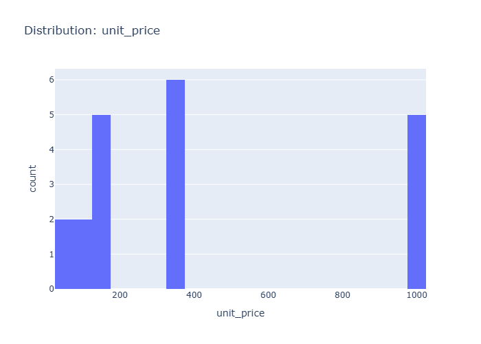

# Insights: Distribution Unit Price

## Data Insight
- The histogram shows a non-uniform distribution of unit prices. There are notable peaks in counts for unit prices around 100-200, 300-400, and at 1000. The majority of unit prices fall within the lower ranges.

## Analysis Insight
- The distribution is multimodal with at least three distinct clusters suggesting different product categories or pricing strategies. The presence of a spike at 1000 might indicate premium products or a specific data entry pattern. The data's standard deviation of 370.34, compared to the mean of 403.49, indicates significant variability.

## Caveat
- With only 20 data points, this distribution might not be representative of the overall product pricing. The binning of the histogram could obscure finer details of the price distribution. Outliers or specific product types could heavily influence these observed peaks.
