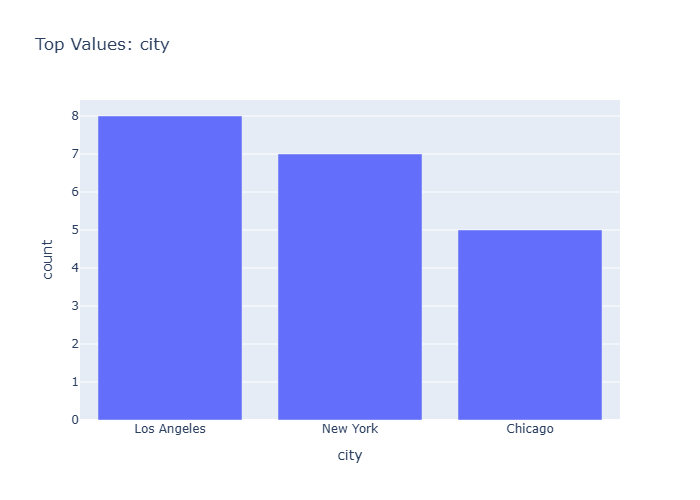
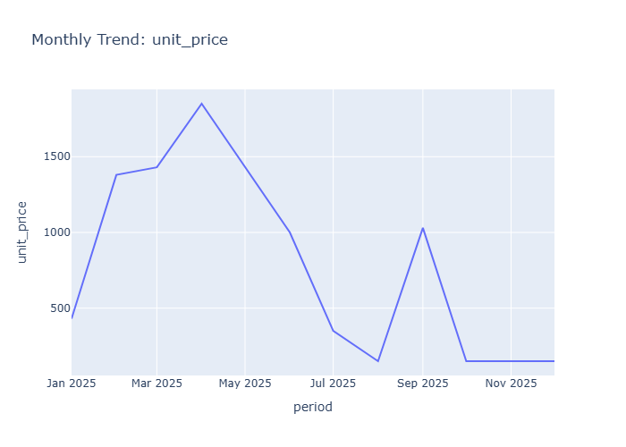
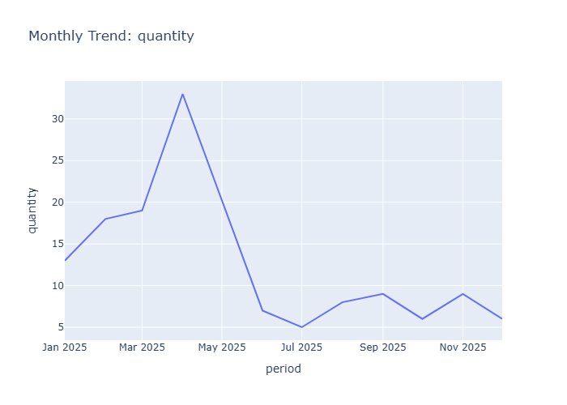

# Final Data Insights

- Generated: 2026-03-28 09:04 UTC
- Model setting: google/gemini-2.5-flash-lite
- LLM-enabled: yes
- Individual insight files: 12

## Dataset Context
- Rows: 20
- Columns: 7
- Numeric columns: 3
- unit_price: mean=403.49, std=370.34
- quantity: mean=6.65, std=1.95
- total_price: mean=2695.93, std=2567.29

## Consolidated Chart Insights

### Overview Numeric Distributions

# Insights: Overview Numeric Distributions

## Data Insight
- The box plot reveals that 'unit_price' and 'total_price' have a wide range of values with significant variability, unlike 'quantity' which is tightly clustered. 'Total_price' exhibits the highest values and spread, indicating a majority of orders fall within a lower range but with some exceptionally high priced orders.

## Analysis Insight
- The distribution for 'unit_price' and 'total_price' is right-skewed, suggesting that most orders have lower prices, but a few orders significantly increase the upper bounds. The 'quantity' column shows minimal variation, with all values appearing to be compressed to a single point.

## Caveat
- The extremely small dataset size (20 rows) limits the generalizability of these distribution insights. The 'quantity' distribution appears anomalous, potentially due to data entry errors or a very specific subset of data, and its interpretation should be approached with caution.

### Correlation Heatmap

# Insights: Correlation Heatmap

## Data Insight
- The heatmap shows a strong positive correlation of 0.94 between unit_price and total_price, and a weak positive correlation of 0.26 between quantity and total_price. Unit_price and quantity have a near-zero correlation (0.02).

## Analysis Insight
- Total price is strongly influenced by unit price, suggesting that higher-priced items contribute more to the total cost. The weak correlation with quantity indicates that the number of items sold might have a less significant impact on total price compared to individual item costs.

## Caveat
- The low number of rows (20) limits the statistical significance and generalizability of these correlation findings. Other unobserved factors ('city', 'date', 'product_name') could confound these relationships.

### Distribution Unit Price

# Insights: Distribution Unit Price

## Data Insight
- The histogram shows a non-uniform distribution of unit prices. There are notable peaks in counts for unit prices around 100-200, 300-400, and at 1000. The majority of unit prices fall within the lower ranges.

## Analysis Insight
- The distribution is multimodal with at least three distinct clusters suggesting different product categories or pricing strategies. The presence of a spike at 1000 might indicate premium products or a specific data entry pattern. The data's standard deviation of 370.34, compared to the mean of 403.49, indicates significant variability.

## Caveat
- With only 20 data points, this distribution might not be representative of the overall product pricing. The binning of the histogram could obscure finer details of the price distribution. Outliers or specific product types could heavily influence these observed peaks.

### Distribution Quantity

# Insights: Distribution Quantity

## Data Insight
- The distribution of quantity shows a peak at 7 units, with a secondary peak at 3 and 5 units. Quantities 4, 8, 9, and 10 have significantly lower counts. The data suggests a preference for moderate quantities, with 7 units being the most frequent order size.

## Analysis Insight
- The histogram visualizes the frequency of different order quantities. The distribution is unimodal with a clear peak at quantity 7, indicating it's the most common order size. The mean quantity is 6.65, which aligns with the visual representation of the distribution's center.

## Caveat
- The dataset size is small (20 rows), limiting the generalizability of these findings. The distribution might change with a larger sample. Additionally, the chart doesn't show quantities below 3 or above 10, so the complete distribution is not represented.

### Distribution Total Price

# Insights: Distribution Total Price

## Data Insight
- The histogram shows that the most frequent total_price range is between 0 and 2000, with 5 occurrences. There are also notable counts in the 0-1000 and 7000-8000 ranges.

## Analysis Insight
- The distribution of total_price appears right-skewed, with a concentration of values at the lower end and a few outliers at higher prices. The bins suggest a significant number of lower-priced transactions.

## Caveat
- The small sample size of 20 rows limits the generalizability of these observations. The bin widths are not uniform, potentially affecting the visual interpretation of the distribution's shape.

### Category Order Id

# Insights: Category Order Id

## Data Insight
- The bar chart displays the frequency count for each order ID. All displayed order IDs have an equal count of 1, indicating that each listed order ID appears only once in this dataset.

## Analysis Insight
- This visualization seems to show the top order IDs, but since all counts are equal, it suggests that the filtering or sorting applied to derive 'Top Values' might not be effective in highlighting distinct orders based on their frequency in this specific subset of data.

## Caveat
- The dataset contains only 20 rows, limiting the scope of 'Top Values.' The observation of equal counts might be an artifact of this small sample size or how the 'Top Values' were selected, rather than a general pattern.

### Category Product Name

# Insights: Category Product Name

## Data Insight
- The bar chart displays the frequency of different product names. 'Monitor' is the most frequent product with 6 occurrences, followed by 'Headphones' and 'Laptop' both with 5 occurrences. 'Mouse' and 'Keyboard' are the least frequent, each appearing twice.

## Analysis Insight
- This visualization highlights the popularity distribution among the top products. Monitors appear to be the most commonly purchased item in this dataset, suggesting potential market demand or availability differences compared to other products like mice and keyboards.

## Caveat
- The dataset is small (20 rows), and the chart only shows the top values for product names. This limits the generalizability of the findings. Other products not shown may be more or less frequent, and the observed popularity could be influenced by factors not present in the data.

### Category City

# Insights: Category City

## Data Insight
- Los Angeles has the highest count of orders at 8, followed by New York with 7, and Chicago with 5. This indicates a concentration of customer activity in these three cities.

## Analysis Insight
- The bar chart visually represents the frequency of orders across different cities. Los Angeles and New York are the most frequent locations for orders within the dataset provided, suggesting a stronger market presence or customer base there.

## Caveat
- The dataset might not represent all cities or a complete time period. The chart only shows counts, not order values or product types, which could offer further insights into city-specific performance.

### Time Series Unit Price

# Insights: Time Series Unit Price

## Data Insight
- The unit price shows significant fluctuations throughout the months. It peaks in May 2025 at approximately 1800, then drops sharply before a smaller peak in September 2025, and stabilizes from November 2025 onwards. The price in January 2025 is around 500.

## Analysis Insight
- The unit price exhibits a volatile trend with a notable peak and subsequent decline. The period from January to May 2025 shows an increasing trend followed by a sharp decrease. The later months show less dramatic, but still present, fluctuations, ending with a plateau.

## Caveat
- The analysis is based on limited data points (20 rows). The observed trends in unit price might not be representative of a longer period or could be influenced by unobserved factors such as specific product sales or promotions.

### Time Series Quantity

# Insights: Time Series Quantity

## Data Insight
- The chart displays a significant peak in quantity in May 2025, reaching over 30 units. Following this peak, there's a sharp decline to about 6 units in July 2025. The quantity fluctuates between 5 and 10 units for the remainder of the period shown.

## Analysis Insight
- The quantity sold shows a volatile trend over the observed period. An initial increase from January to May is followed by a dramatic drop. The latter half of the year exhibits smaller fluctuations, suggesting a stabilization at a lower volume after the May peak.

## Caveat
- The dataset contains only 20 rows, meaning the monthly trends are based on limited data points. The chart does not show the products or cities involved, limiting deeper analysis into the drivers of these quantity changes.

### Time Series Total Price

# Insights: Time Series Total Price

## Data Insight
- Total price shows a peak in May 2025, reaching approximately 14.5k. Following this peak, there's a significant decline through July 2025, before a slight recovery in September and a gradual decrease towards November 2025.

## Analysis Insight
- The time series reveals substantial month-over-month fluctuations in total price throughout 2025. The period from March to May 2025 indicates a sharp increase, contrasting with the steep drop observed between May and July 2025.

## Caveat
- The dataset contains only 20 rows, making this monthly trend analysis based on limited data points. Unspecified factors or external events occurring within these months could be influencing the total price trends beyond product sales.

### Overview Scatter Unit Price Vs Total Price

# Insights: Overview Scatter Unit Price Vs Total Price

## Data Insight
- The scatter plot displays a generally positive correlation between unit price and total price. Most data points cluster at lower unit prices, with total prices increasing as unit prices rise, suggesting that higher-priced items also result in higher total order values.

## Analysis Insight
- The data indicates that total price tends to increase with unit price. However, there are multiple orders with similar unit prices but varying total prices, and vice versa, implying that quantity, or other unplotted factors, significantly influences the total price per order.

## Caveat
- The analysis is based on a limited sample of 20 orders. The relationship between unit price and total price might be influenced by the quantity of items purchased, which is not directly visualized here, and potential variations in product types.

