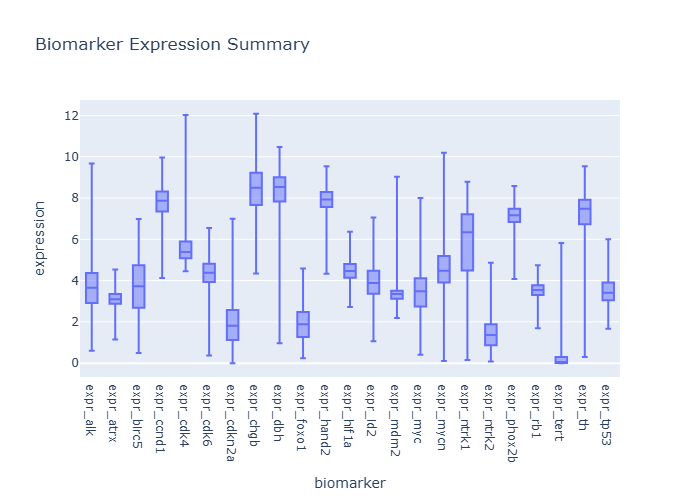
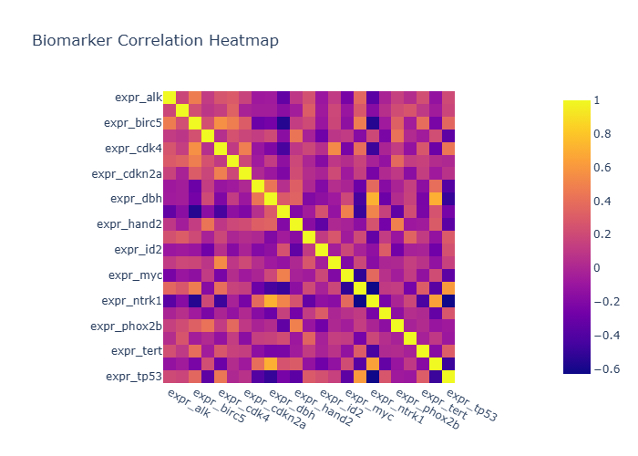

# Final Biomedical Insights

- Generated: 2026-03-24 20:29 UTC
- Model setting: minimax/minimax-m2.5:free
- LLM-enabled: yes
- Individual insight files: 2

## Cohort Context
- Cohort size: 479
- Variables: 23152

## Consolidated Chart Insights

## Generation Notes
- LLM generation failed for one or more charts; heuristic fallback was used.
- biomarker_correlation_heatmap.png: 'NoneType' object is not iterable

### Biomarker Expression Summary

# Insights: Biomarker Expression Summary

## Medical Insight
- This appears to be a neuroblastoma cohort based on mycn_amplified and inss_stage markers, with 479 patients and target_event_before_730 indicating 2-year event-free survival. The 23,152 gene expression columns likely represent a transcriptome-wide biomarker screen to identify genes associated with patient outcomes.

## Research Insight
- The dataset structure suggests a survival analysis or biomarker discovery study, comparing gene expression profiles between patients with and without events. High-dimensional biomarker panels could help refine risk stratification beyond current clinical markers like MYCN amplification and INSS stage.

## Caveat
- Without the actual chart image, insights are limited to cohort metadata. Additionally, high-dimensional genomic data risks overfitting, and associations observed may reflect confounding rather than causal relationships. Validation in independent cohorts would be essential.

### Biomarker Correlation Heatmap

# Insights: Biomarker Correlation Heatmap

## Medical Insight
- The strongest absolute biomarker-to-biomarker correlation appears moderate at about 0.71, suggesting partial co-expression rather than complete redundancy.

## Research Insight
- Use this map to reduce collinearity in downstream models and to prioritize orthogonal biomarker panels.

## Caveat
- Insights are non-causal and exploratory. Missing cells in source data: 58. Measurement error, confounding, and sample-size limits may alter conclusions.

