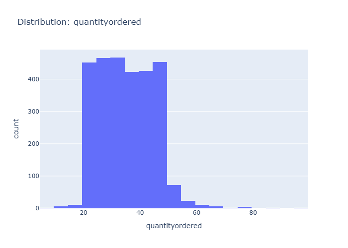
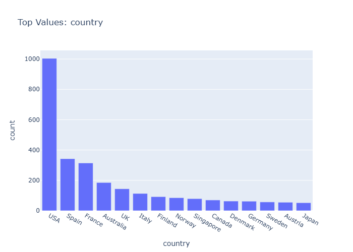
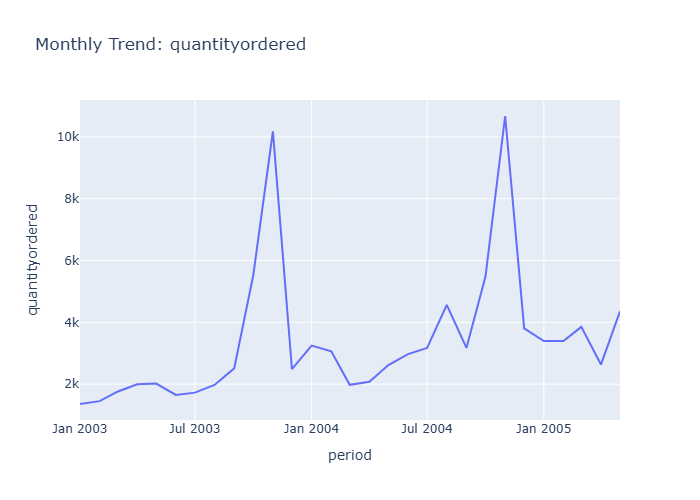

# Final Data Insights

- Generated: 2026-03-27 17:46 UTC
- Model setting: google/gemini-2.5-flash-lite
- LLM-enabled: yes
- Individual insight files: 19

## Dataset Context
- Rows: 2823
- Columns: 25
- Numeric columns: 10
- ordernumber: mean=10258.73, std=92.09
- quantityordered: mean=35.09, std=9.74
- priceeach: mean=83.66, std=20.17

## Consolidated Chart Insights

## Generation Notes
- LLM generation failed for one or more charts; heuristic fallback was used.
- distribution_priceeach.png: LLM output was not valid JSON.

### Overview Numeric Distributions

# Insights: Overview Numeric Distributions

## Data Insight
- The 'postalcode' column exhibits a wide range of values, with a dense concentration of lower values and a few outliers extending to nearly 100k. Other numeric columns like 'ordernumber' and 'sales' show much tighter distributions.

## Analysis Insight
- The box plot indicates significant variation in monetary values represented by 'sales' and 'postalcode'. 'Sales' appears to have a more conventional distribution, while 'postalcode' suggests potential data entry issues or a wide geographic spread.

## Caveat
- The 'postalcode' distribution's extreme range might be due to data entry errors or how zip codes are encoded. Without further context, it's difficult to determine if these are genuine values or require cleaning.

### Correlation Heatmap

# Insights: Correlation Heatmap

## Data Insight
- Sales show a strong positive correlation with quantity ordered (0.55) and price each (0.66). Order number is highly correlated with year (0.90), indicating a potential increase in order volume over time. Quarter and month IDs are strongly correlated (0.98), as expected.

## Analysis Insight
- The heatmap reveals significant positive correlations between sales and both quantity ordered and price each. The strong correlation between order number and year suggests a growing customer base or order frequency. Quartile and month IDs exhibit very high correlation, as they are intrinsically linked.

## Caveat
- These correlations do not imply causation. Other factors not present in this heatmap (e.g., marketing campaigns, economic conditions) could influence sales. The 'year_id' correlation might be influenced by the specific time period covered by the data.

### Distribution Ordernumber

# Insights: Distribution Ordernumber

## Data Insight
- The distribution of order numbers appears relatively uniform, suggesting that order numbers are assigned sequentially without significant gaps or clusters. The mean order number is approximately 10,259, with a standard deviation of 92, indicating a tight and consistent range of order values.

## Analysis Insight
- The histogram shows a unimodal distribution skewed slightly to the right. Most orders fall within the early to mid-10,000s range. The standard deviation suggests that actual order numbers are closely clustered around the mean, implying a regular order processing cadence.

## Caveat
- This analysis assumes order numbers are assigned chronologically. External factors not present in the metadata, such as system resets or manual order numbering, could affect the interpretation of this distribution. The chart only visualizes order numbers, not their associated sales or customer value.

### Distribution Quantityordered

# Insights: Distribution Quantityordered

## Data Insight
- The bar chart displays the distribution of 'quantityordered'. The majority of orders fall within the 30-40 quantity range, with a noticeable peak around 30. Frequencies decrease as quantities move away from this central range in either direction.

## Analysis Insight
- The 'quantityordered' variable appears to be unimodally distributed, suggesting a common order size is concentrated around 30 units. This could indicate typical purchasing behavior or inventory management practices influencing order volumes.

## Caveat
- The chart does not provide information on the underlying reasons for the observed distribution. Factors like product type, customer segment, or promotional activities could influence order quantities and are not depicted.

### Distribution Priceeach

# Insights: Distribution Priceeach

## Data Insight
- The distribution of 'priceeach' reveals the spread and shape of values. Skewed distributions or outliers may warrant transformation before modelling.

## Analysis Insight
- Highly skewed distributions may benefit from log or Box-Cox transformation before statistical modelling.

## Caveat
- Insights are exploratory and non-causal. Missing cells in source data: 5622. Sample size, data quality, and unmeasured variables may affect conclusions.

### Distribution Orderlinenumber

# Insights: Distribution Orderlinenumber

## Data Insight
- The histogram displays a distribution of order line numbers, showing a clear downward trend. The highest frequency of orders occurs with fewer line items, decreasing as the number of line items per order increases.

## Analysis Insight
- The data suggests that most orders tend to be concise, with a significant majority having a small number of line items. The frequency drops sharply after the first few line items, indicating fewer complex orders with many items.

## Caveat
- The chart does not reveal the total number of line items possible per order, nor does it account for the nature of the products ordered. The distribution could be affected by product availability or typical purchasing behavior.

### Distribution Sales

# Insights: Distribution Sales

## Data Insight
- The distribution of sales is right-skewed, with the majority of sales falling between 1,000 and 4,000. There are fewer occurrences of sales exceeding 4,000, and a long tail extends to the right, indicating occasional high-value sales.

## Analysis Insight
- The histogram shows a prominent peak in sales between 2,000 and 4,000 units. The sales data appears to be concentrated in the lower to mid-range, with a decreasing frequency as sales values increase.

## Caveat
- This analysis is based on the provided sales data and does not account for other factors that might influence sales, such as marketing campaigns, seasonality, or economic conditions, which could lead to confounding variables.

### Distribution Qtr Id

# Insights: Distribution Qtr Id

## Data Insight
- The bar chart shows the distribution of orders across quarters. Quarter 4 has the highest number of orders, followed by Quarter 1, Quarter 2, and then Quarter 3, which has the fewest orders.

## Analysis Insight
- Sales data is significantly skewed towards the fourth quarter, with over 1000 orders. The other quarters show a more even distribution, but with substantially fewer orders compared to Q4.

## Caveat
- The exact number of orders for each quarter is not precisely labeled, and the chart does not account for the total number of days or business activity within each quarter, which could influence order volume.

### Category Status

# Insights: Category Status

## Data Insight
- The bar chart displays the frequency count of different order statuses. 'Shipped' is the overwhelmingly most frequent status, with approximately 2600+ occurrences. All other statuses, including 'Cancelled', 'Resolved', 'On Hold', 'In Process', and 'Disputed', have significantly lower counts, each with fewer than 100 occurrences.

## Analysis Insight
- The data indicates a high volume of successfully shipped orders, suggesting efficient order fulfillment. The low counts for other statuses may point to a streamlined process or infrequent issues. Further investigation could explore the characteristics and reasons behind the 'Disputed' and 'Cancelled' orders.

## Caveat
- The chart shows raw counts and does not account for the total number of orders attempted or the value of orders in each status. The low counts for other statuses could be due to infrequent issues or errors in data recording and categorization.

### Category Productline

# Insights: Category Productline

## Data Insight
- The bar chart displays the count of orders for different product lines, with 'Classic Cars' being the most frequent, followed by 'Vintage Cars'. 'Trains' has the lowest order count.

## Analysis Insight
- Classic Cars and Vintage Cars are the dominant product lines in terms of order volume. The substantial difference in order counts between these top categories and the others suggests a varied market demand.

## Caveat
- This chart only shows the count of orders, not sales value or profit margins, so it doesn't reflect the overall business impact of each product line. Other factors could influence these numbers.

### Category Addressline2

# Insights: Category Addressline2

## Data Insight
- The vast majority of records (approximately 2500) have a missing value for 'addressline2'. Among the present values, 'Level 3', 'Suite 400', 'Level 6', 'Level 15', '2nd Floor', 'Suite 101', 'Suite 750', 'Floor No. 4', and 'Suite 200' appear infrequently.

## Analysis Insight
- The 'addressline2' field exhibits severe data sparsity, with a prevalence of missing entries. This suggests potential issues with data collection or entry for this specific field, hindering detailed location-based analysis.

## Caveat
- The significant number of missing 'addressline2' values limits the reliability of any analysis focusing on address-specific trends or segments. Further investigation into data collection processes is recommended.

### Category State

# Insights: Category State

## Data Insight
- The state 'CA' has the highest count of orders, exceeding 1400.  The second highest category is '<missing>' with approximately 400 orders, followed by 'MA' with around 200 orders.  All other states have significantly fewer orders.

## Analysis Insight
- California appears to be a primary market. The substantial number of missing state values suggests potential data quality issues or a significant number of customers with unrecorded locations, warranting further investigation.

## Caveat
- The chart shows counts, not sales value or volume. The category '<missing>' could represent various reasons for unrecorded data, and its high frequency might skew interpretations of geographic performance without further data treatment.

### Category Country

# Insights: Category Country

## Data Insight
- The USA is the leading country in terms of order count, significantly surpassing other nations. Spain and France follow as the second and third most frequent countries for orders, respectively. The majority of other countries have notably lower order counts.

## Analysis Insight
- This bar chart displays the frequency distribution of orders across different countries. A clear hierarchy is evident, with the USA dominating the landscape. The plot suggests potential geographical concentrations of customer activity or sales operations.

## Caveat
- The chart represents order counts, not sales value or volume. Other factors, such as average order value or quantity per order, may differ significantly between countries, impacting overall business performance.

### Category Territory

# Insights: Category Territory

## Data Insight
- The EMEA territory has the highest number of orders, followed by a significant portion of orders with missing territory information. APAC and Japan territories have considerably fewer orders.

## Analysis Insight
- EMEA is the most represented territory in the dataset. The presence of a '<missing>' category suggests potential data entry issues or incomplete records for a substantial number of orders.

## Caveat
- The analysis is limited by the presence of missing territory data, which may skew the perceived distribution across regions. The represented territories might not cover all geographical sales areas.

### Category Dealsize

# Insights: Category Dealsize

## Data Insight
- The bar chart shows that 'Medium' and 'Small' deal sizes are the most frequent categories, with counts around 1400 and 1250 respectively. 'Large' deal sizes are significantly less frequent, with a count below 200.

## Analysis Insight
- Most deals observed in the dataset are categorized as 'Medium' or 'Small'. This suggests a business strategy or market dynamic that favors or results in a higher volume of smaller to medium-sized transactions compared to large ones.

## Caveat
- The chart only displays the count of deals by size category. It does not provide information on the total sales value for each category, the time period covered, or potential data inaccuracies in the 'dealsize' classification.

### Time Series Ordernumber

# Insights: Time Series Ordernumber

## Data Insight
- The time series displays significant peaks in 'ordernumber' around January of 2004 and January of 2005, indicating a strong seasonal trend for order placement during the beginning of the year.

## Analysis Insight
- The data suggests a recurring surge in orders at the start of each year observed in the chart. This pattern is more pronounced in January 2004 than in January 2005, with a gradual increase leading up to these peaks.

## Caveat
- The chart shows 'ordernumber' on the Y-axis, but the specific unit or exact count represented by each data point is not explicitly defined, leading to potential ambiguity in interpreting the magnitude of the order numbers.

### Time Series Quantityordered

# Insights: Time Series Quantityordered

## Data Insight
- The quantity ordered shows a cyclical pattern, with two distinct peaks around January of 2004 and 2005. Overall quantity ordered appears to increase between the first half of 2003 and the first half of 2005.

## Analysis Insight
- The time series exhibits strong seasonality, with significant spikes in order volume occurring annually, likely corresponding to holiday seasons or specific sales events. This recurring pattern suggests predictable demand fluctuations.

## Caveat
- The chart displays data for only a portion of 2003-2005. It's unclear if the observed peaks represent the entirety of peak sales periods or if external factors like marketing campaigns influence these trends.

### Time Series Priceeach

# Insights: Time Series Priceeach

## Data Insight
- The 'priceeach' exhibits significant monthly fluctuations, with prominent peaks occurring around January of 2004 and 2005. These peaks represent substantial increases in the average price of items sold during those periods.

## Analysis Insight
- The price trend shows a cyclical pattern with large spikes at the beginning of each year, suggesting potential seasonal sales events, promotions, or changes in product mix that drive up average prices.

## Caveat
- The chart doesn't display the volume of sales, so it's unclear if high average prices correspond to high sales volume or just a few high-value transactions. Other factors like product returns or data entry errors could also influence these price spikes.

### Overview Scatter Qtr Id Vs Month Id

# Insights: Overview Scatter Qtr Id Vs Month Id

## Data Insight
- The scatter plot indicates a general trend where increasing quarter ID (qtr_id) corresponds to higher month IDs (month_id). Orders with statuses 'Shipped' and 'Cancelled' appear across various quarters, while 'Disputed', 'In Process', 'On Hold', and 'Resolved' statuses are concentrated in the first quarter.

## Analysis Insight
- Quarter 1 (qtr_id=1) shows a distribution of month IDs from 1 to 3, predominantly with statuses other than 'Shipped' or 'Cancelled'. Quarters 2, 3, and 4 show limited data points, with 'Shipped' and 'Cancelled' statuses becoming more prevalent as qtr_id increases.

## Caveat
- The visualization uses discrete numerical representations for quarters and months, which might oversimplify the temporal relationships. The limited data points in later quarters, especially for certain statuses, limit the generalizability of observed patterns and could be due to sampling or data availability.

