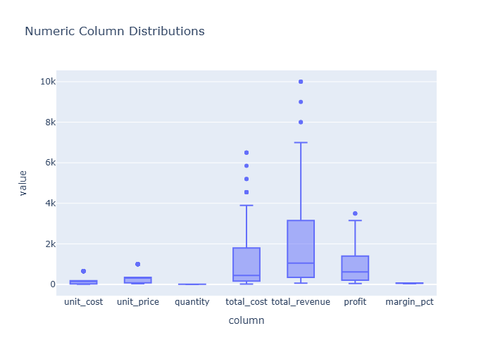

# Insights: Overview Numeric Distributions

## Data Insight
- The numeric variables show right-skewed distributions with means substantially higher than medians (implied by high standard deviations relative to means). Unit_cost ranges widely (std=252.72 vs mean=219.84), unit_price shows similar variability (std=370.50 vs mean=376.69), and total_cost has the largest spread (std=1753.29). Quantity appears most normally distributed with the lowest coefficient of variation (~47%).

## Analysis Insight
- The high variability in cost and price variables suggests diverse product portfolios or pricing strategies. The relationship between unit_cost and unit_price (means of 219.84 and 376.69 respectively) implies consistent markup behavior. Total_cost's high standard deviation reflects both quantity and unit_cost variation. The relatively stable quantity distribution indicates consistent order sizes across transactions.

## Caveat
- Distribution shape assumptions are based on summary statistics alone without access to actual visualizations; skewness and outliers cannot be confirmed. Missing data, potential measurement errors, and unobserved confounding factors (e.g., product categories, seasonal effects) limit interpretation. The 100-row sample may not represent broader population patterns.
