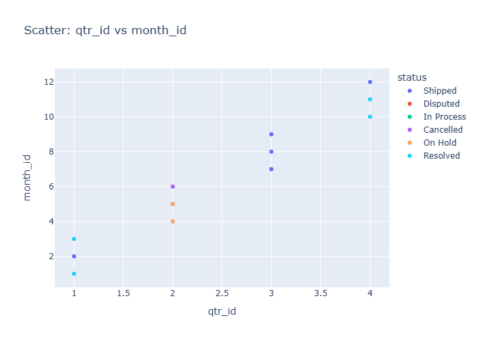

# Insights: Overview Scatter Qtr Id Vs Month Id

## Data Insight
- The scatter plot indicates a general trend where increasing quarter ID (qtr_id) corresponds to higher month IDs (month_id). Orders with statuses 'Shipped' and 'Cancelled' appear across various quarters, while 'Disputed', 'In Process', 'On Hold', and 'Resolved' statuses are concentrated in the first quarter.

## Analysis Insight
- Quarter 1 (qtr_id=1) shows a distribution of month IDs from 1 to 3, predominantly with statuses other than 'Shipped' or 'Cancelled'. Quarters 2, 3, and 4 show limited data points, with 'Shipped' and 'Cancelled' statuses becoming more prevalent as qtr_id increases.

## Caveat
- The visualization uses discrete numerical representations for quarters and months, which might oversimplify the temporal relationships. The limited data points in later quarters, especially for certain statuses, limit the generalizability of observed patterns and could be due to sampling or data availability.
