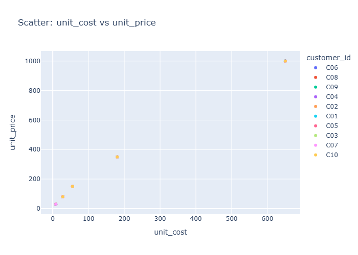

# Insights: Overview Scatter Unit Cost Vs Unit Price

## Data Insight
- The scatter plot displays unit cost on the x-axis and unit price on the y-axis. Points above the diagonal represent profitable transactions (price > cost), while points below indicate losses. The distribution shows positive correlation between cost and price, with substantial variance in pricing markup across different cost levels. Most transactions cluster in the lower cost range (0-300), with fewer high-cost items (500+).

## Analysis Insight
- The vertical spread of points at each cost level reveals inconsistent markup strategies. Some high-cost items receive minimal markup while lower-cost items show wider price variation. This suggests heterogeneous pricing decisions rather than uniform margin targets. The profit column confirms varying profitability, though the chart alone shows price-cost relationship patterns without confirming actual profit outcomes.

## Caveat
- This scatter plot shows correlation but not causation; external factors like customer segment, store location, or product type may confound the cost-price relationship. The dataset lacks time-based ordering visible in the chart, preventing analysis of pricing evolution. Aggregate data obscures individual transaction variability and potential data entry errors.
