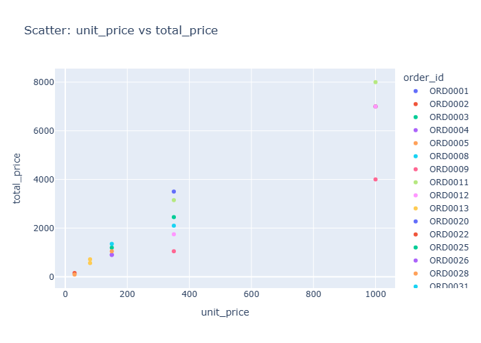

# Insights: Overview Scatter Unit Price Vs Total Price

## Data Insight
- The scatter plot displays a generally positive relationship between unit price and total price, indicated by points clustering towards the upper right. However, there are distinct groups of points suggesting potential variations in quantity or product type, such as orders with similar unit prices but different total prices.

## Analysis Insight
- When unit price increases, total price tends to increase as well, but the number of data points is small. The data appears segmented, with several orders having unit prices around 400 and others around 100, each with varying total prices suggesting differences in quantity or product.

## Caveat
- With only 20 data points, observed patterns may not be statistically significant or generalizable. The scatter plot does not account for the 'quantity' variable, which is a crucial factor in determining total price and could explain the observed variations.
