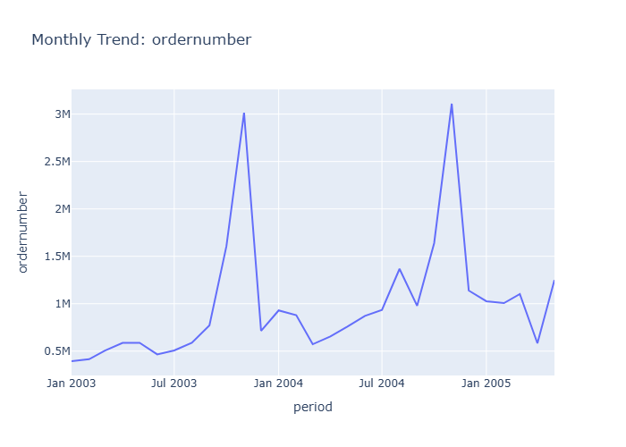

# Insights: Time Series Ordernumber

## Data Insight
- The time series displays significant peaks in 'ordernumber' around January of 2004 and January of 2005, indicating a strong seasonal trend for order placement during the beginning of the year.

## Analysis Insight
- The data suggests a recurring surge in orders at the start of each year observed in the chart. This pattern is more pronounced in January 2004 than in January 2005, with a gradual increase leading up to these peaks.

## Caveat
- The chart shows 'ordernumber' on the Y-axis, but the specific unit or exact count represented by each data point is not explicitly defined, leading to potential ambiguity in interpreting the magnitude of the order numbers.
