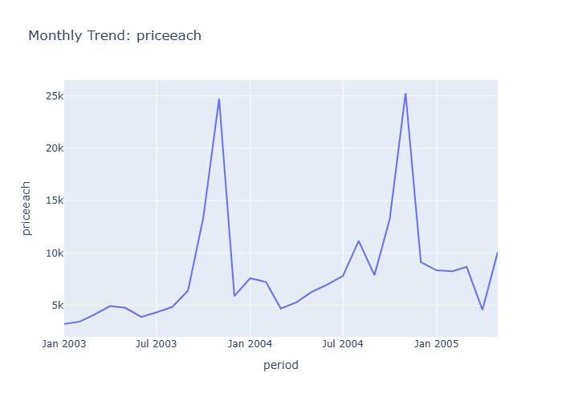

# Insights: Time Series Priceeach

## Data Insight
- The 'priceeach' exhibits significant monthly fluctuations, with prominent peaks occurring around January of 2004 and 2005. These peaks represent substantial increases in the average price of items sold during those periods.

## Analysis Insight
- The price trend shows a cyclical pattern with large spikes at the beginning of each year, suggesting potential seasonal sales events, promotions, or changes in product mix that drive up average prices.

## Caveat
- The chart doesn't display the volume of sales, so it's unclear if high average prices correspond to high sales volume or just a few high-value transactions. Other factors like product returns or data entry errors could also influence these price spikes.
