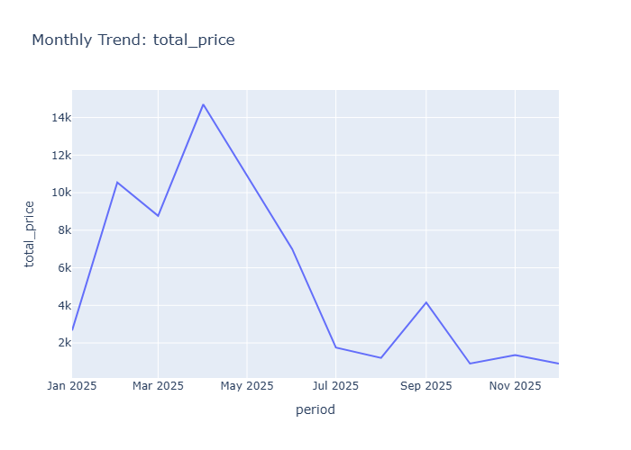

# Insights: Time Series Total Price

## Data Insight
- Total price shows a peak in May 2025, reaching approximately 14.5k. Following this peak, there's a significant decline through July 2025, before a slight recovery in September and a gradual decrease towards November 2025.

## Analysis Insight
- The time series reveals substantial month-over-month fluctuations in total price throughout 2025. The period from March to May 2025 indicates a sharp increase, contrasting with the steep drop observed between May and July 2025.

## Caveat
- The dataset contains only 20 rows, making this monthly trend analysis based on limited data points. Unspecified factors or external events occurring within these months could be influencing the total price trends beyond product sales.
