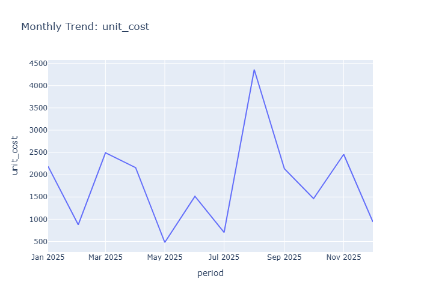

# Insights: Time Series Unit Cost

## Data Insight
- The dataset contains 100 orders with unit cost averaging 219.84 (std=252.72) and unit price averaging 376.69 (std=370.50). Quantity per order averages 6.12 units, with total cost mean of 1341.73. The high standard deviations relative to means indicate substantial variability in pricing and cost structures across transactions.

## Analysis Insight
- The ratio of unit_price to unit_cost (~1.71) suggests positive markup across products. Wide cost and price distributions may reflect diverse product categories or customer segments. The file stem indicates temporal analysis potential, though date-based trends in unit cost require chart examination.

## Caveat
- Without seeing the actual time series chart, insights are limited to aggregate statistics. High standard deviations may reflect data heterogeneity, outliers, or measurement inconsistency. Confounding factors like product type, store location, or temporal inflation are not controlled in this summary.
